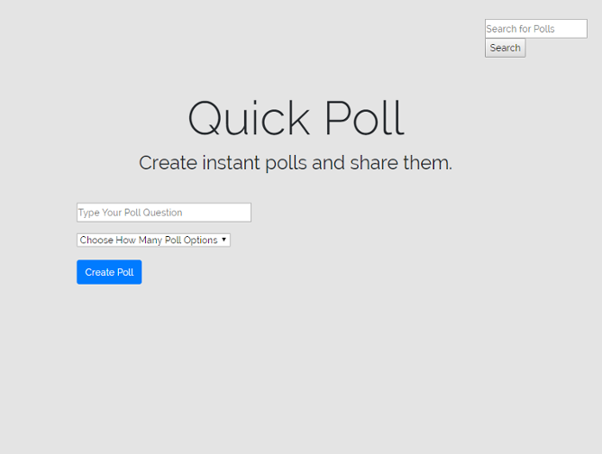
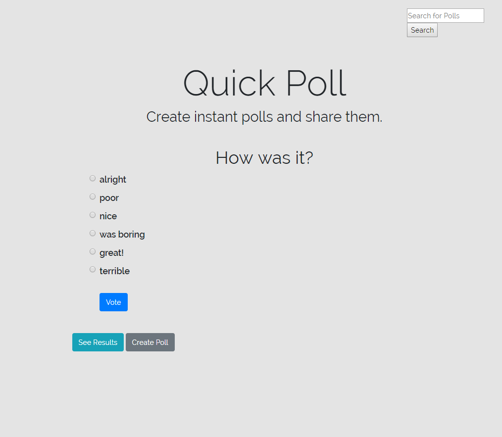
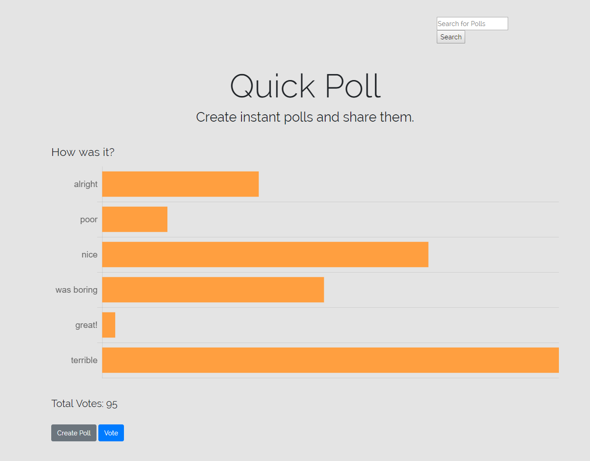

# Laravel Poll App

Inspired by apps such as strawpoll.me, this is for making quick polls that
create a link that can be shared by others and voted on without authentication.

You can also use the app at this link:
[quickpoll](https://quickpoll-39797.herokuapp.com/)

# Installation and Usage

Clone the Repository:
> git https://github.com/jhguidry/quickpoll.git

Change into the folder, install composer if you do not already have it, then 
create a database. Edit the values in the .env with your database configuration. Afterwards, migrate the database with
> php artisan migrate

Finally, see it with  

> php artsian serve

# Images

